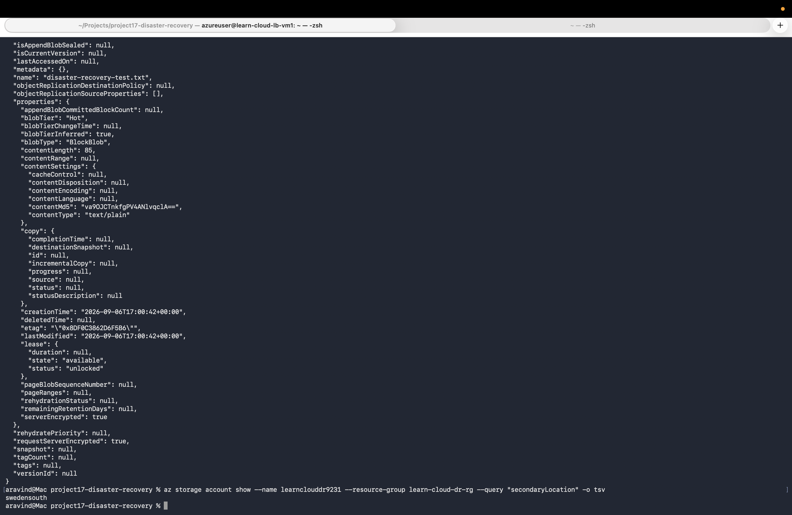
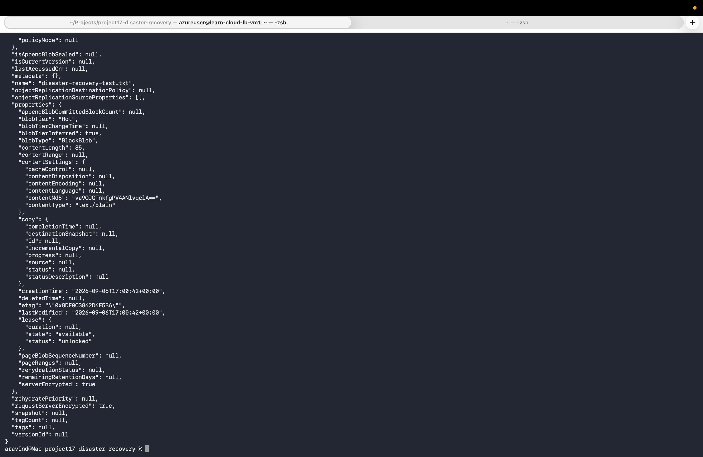

# Project 17: Disaster Recovery — Geo-Redundant Storage + Real Failover

## What this project demonstrates
Configured Read-Access Geo-Redundant Storage (RA-GRS), proved data genuinely replicates to a paired secondary region with real verification (not just trusting the configuration label), then triggered an actual storage account failover — simulating a real regional disaster and confirming the data survived.

## Architecture
```
Storage Account (learnclouddr9231) — RA-GRS
├── Primary region: swedencentral
└── Secondary region: swedensouth (Azure's automatic pairing)

Before failover:
File uploaded to primary -> automatically replicated to secondary
Verified independently via secondary endpoint (matching etag confirmed)

Failover triggered:
swedensouth promoted to new primary
swedencentral disconnected (now Standard_LRS, no longer geo-redundant)

After failover:
Same file, same etag, still accessible via the normal endpoint
-> now transparently served from what was the secondary region

## What I learned
- RA-GRS (Read-Access Geo-Redundant Storage) automatically, continuously copies blob data to a paired secondary region, and — unlike plain GRS — allows active reads from that secondary region even while the primary is fully healthy
- How to verify geo-replication actually happened, not just assume it from the configuration: querying the storage account's distinct secondary endpoint directly and confirming matching file properties (etag, content length)
- **Geo-redundancy is scoped to the specific resource, not the resource group.** A resource group is purely an organizational label in Azure Resource Manager — it has no data of its own to replicate. Only the storage account's actual data gets copied to the secondary region.
- **Different resource types require entirely separate disaster recovery mechanisms.** Storage uses GRS/RA-GRS. Virtual Machines require Azure Site Recovery, which replicates full disk images and can actually spin up a running VM in the secondary region during failover — a fundamentally different, heavier process than storage's automatic file replication. Databases like Azure SQL use yet another mechanism (auto-failover groups). There is no single "protect everything in this resource group" setting — real DR planning means deliberately configuring each critical resource type individually.
- After a failover, the storage account automatically reverts to plain LRS in the new primary region — it is not automatically geo-redundant again until manually reconfigured, which is expected, standard Azure behavior

## Tools used
- Azure CLI
- Azure Storage (RA-GRS)
- Azure RBAC (Storage Blob Data Contributor role assignment, required separately from storage account management permissions)

## Proof it works

**File verified as genuinely present in the secondary region, before any failover — matching etag confirms this is real replication, not a re-upload:**


**After triggering a real failover, the same file (same etag) remains accessible through the normal endpoint — now transparently served from what used to be the secondary region:**


## Debugging notes
- Hit a permissions error (`az storage blob upload` denied) despite being the storage account's owner — Azure separates "who can manage the storage account resource" from "who can read/write the actual blob data inside it." Resolved by explicitly assigning the "Storage Blob Data Contributor" RBAC role, scoped to the storage account, and waiting a couple of minutes for the role assignment to propagate.

## Cost note
RA-GRS costs more per GB than LRS due to the secondary region replication, but with a single small test file, the cost was negligible. The account (now Standard_LRS post-failover) was deleted after project completion.
